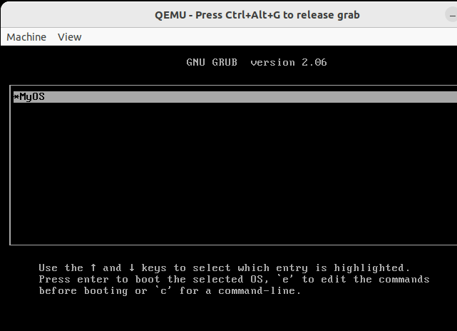

# Custom OS

Writing a Custom Operating System

For technical information see:

* [Pt1-CrossCompiler](https://www.dennissalzner.de/programming/2021/12/11/Sa-CustomOsPt1-CrossCompiler.html)
* [Pt2-Kernel](https://www.dennissalzner.de/programming/2021/12/15/Mi-CustomOsPt2-Kernel.html)
* [Pt3-KeyboardPolling](https://www.dennissalzner.de/programming/2021/12/16/Do-CustomOsPt3-KeyboardPolling.html)
* [Pt4-Interrupts](https://www.dennissalzner.de/programming/2021/12/20/Di-CustomOsPt4-Interrupts.html)
* [Pt5-DiskIo](https://www.dennissalzner.de/programming/2023/08/16/Mi-CustomOsPt5-DiskIo.html)
* [Pt6-Graphics](https://www.dennissalzner.de/programming/2024/01/27/Sa-CustomOsPt6-Graphics.html)
* [Pt7-Shell-Rust](https://www.dennissalzner.de/programming/2024/01/28/So-CustomOsPt7-Shell-Rust.html)
* [Pt8-Terminal](https://www.dennissalzner.de/programming/2024/02/04/So-CustomOsPt8-Terminal.html)
* [Pt9-Enhancements](https://www.dennissalzner.de/programming/2024/02/04/Sa-CustomOsPt9-Enhancements.html)

## Dependencies

The code is inspired by many other public domain CustomOS GitHub repos cited in the blog posts and most notably the guides and examples from the osdev-forums and wiki [1]

1] https://wiki.osdev.org

## Contributing & Compiling from source

The code can be compiled from source on Linux with the build.sh file.
The Arduino project file (*.ino) can also be loaded into the Arduino IDE and built from there.

Anyone is welcome to contribute, see [Guide on Contributing](CONTRIBUTING.md)

##
